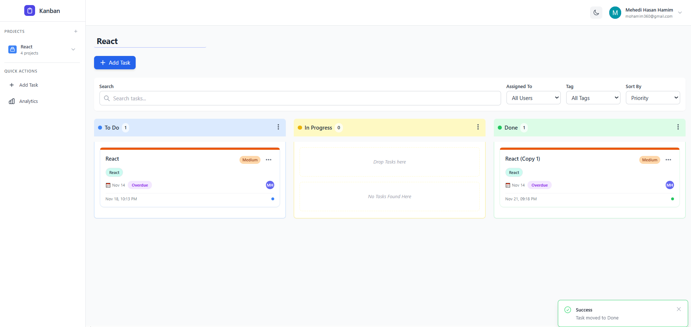
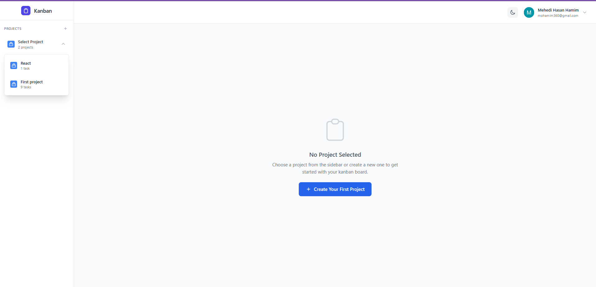
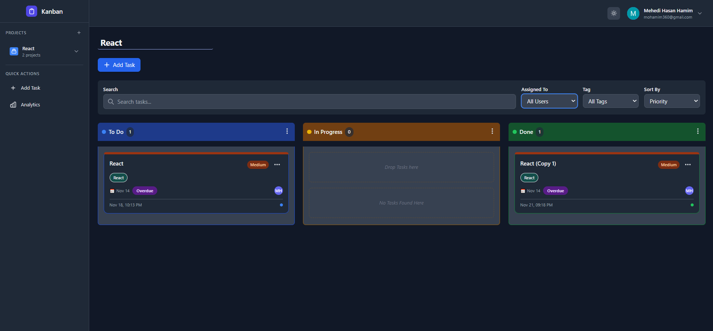
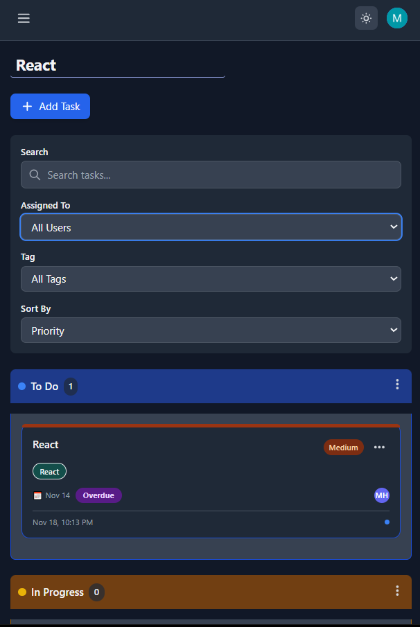
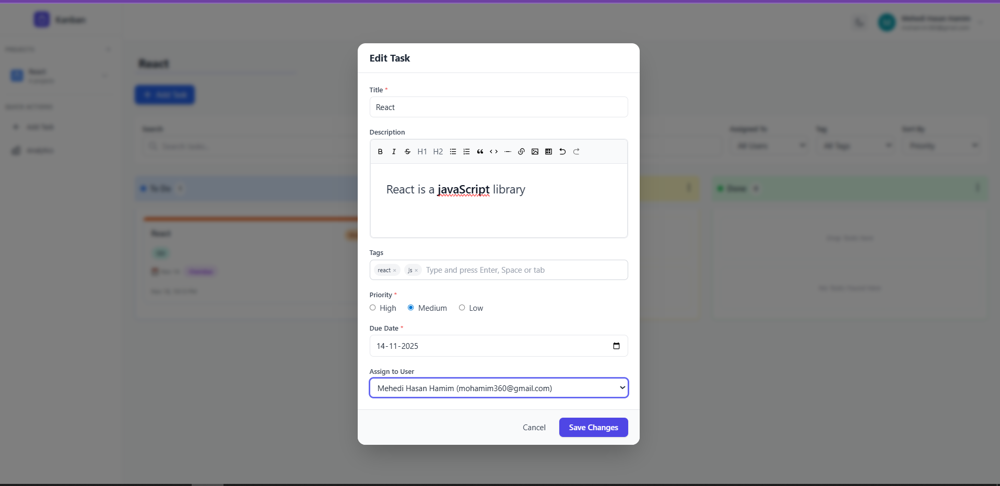

# Vue Kanban Board - Full Stack Project Management Application

A modern, full-featured Kanban board application built with Vue 3 and a robust backend API, featuring user authentication via Clerk, real-time project management, and collaborative task tracking.



## 🌟 Features

### 🔐 Authentication & User Management

- **Clerk Integration**: Enterprise-grade authentication with sign-in/sign-out
- **User Profiles**: Display user information with profile images
- **Protected Routes**: Secure API endpoints with JWT token validation
- **Multi-user Support**: Assign tasks to team members and track ownership

### 📁 Project Management

- **Multiple Projects**: Create, switch between, and manage unlimited projects
- **Project Dropdown**: Quick project selection from sidebar
- **Project CRUD**: Full create, read, update, delete operations
- **Task Tracking**: Automatic task count per project
- **Confirmation Dialogs**: Safe deletion with user confirmation

### 🎨 Modern UI/UX

- **Responsive Design**: Mobile-first approach with desktop optimization
- **Dark Mode**: Toggle between light and dark themes with persistent preference
- **Collapsible Sidebar**: Adaptive sidebar for mobile and desktop
- **Professional Navbar**: User profile dropdown with settings
- **Smooth Animations**: Polished transitions and micro-interactions
- **Toast Notifications**: Real-time feedback for all actions

### 📋 Kanban Board Features

- **Drag & Drop**: Seamless task movement between columns (To Do, In Progress, Done)
- **Task Management**: Add, edit, clone, and delete tasks
- **Priority Levels**: High, Medium, Low with visual indicators and color coding
- **Due Dates**: Set deadlines with overdue detection and badges
- **User Assignment**: Assign tasks with avatar display and tooltips
- **Rich Text Editing**: TipTap editor with formatting, links, and images
- **Tags System**: Organize tasks with custom, colorful tags
- **Search & Filter**: Advanced filtering by user, tag, and text search
- **Sorting Options**: Sort by priority, due date, creation date, or title

### 🔍 Advanced Filtering

- **Search Bar**: Full-text search across task titles and descriptions
- **User Filter**: Filter by assigned user or show unassigned tasks
- **Tag Filter**: Filter by specific tags
- **Smart Filtering**: Combine multiple filters for precise results

### 🎯 Task Features

- **Clone Tasks**: Duplicate tasks with auto-incrementing copy numbers
- **Bulk Operations**: Delete all tasks in a column or project
- **Task Details**: Rich descriptions with formatting
- **Overdue Indicators**: Visual badges for expired tasks
- **User Tooltips**: Hover over avatars to see user details
- **Creation Timestamps**: Track when tasks were created

## 📸 Screenshots

### Light Mode


### Dark Mode


### Mobile View


### Task Editing


## 🏗️ Architecture

### Frontend Stack
- **Vue 3**: Composition API with reactive state management
- **Vite**: Lightning-fast build tool and dev server
- **Tailwind CSS**: Utility-first styling with custom components
- **Clerk Vue**: Authentication SDK with built-in UI components
- **Axios**: HTTP client with interceptors for auth
- **TipTap**: Modern rich text editor
- **VueUse**: Collection of essential Vue composition utilities
- **Heroicons**: Beautiful SVG icon set

### Backend Integration
- RESTful API with JWT authentication
- PostgreSQL database with Prisma ORM
- Real-time data synchronization
- Error handling and validation

## 🚀 Getting Started

### Prerequisites

- Node.js 16 or higher
- npm or yarn package manager
- Clerk account ([clerk.com](https://clerk.com))
- Backend API running (separate repository)

### Installation

1. **Clone the repository**
   ```bash
   git clone <repository-url>
   cd vue-kanban-board
   ```

2. **Install dependencies**
   ```bash
   npm install
   ```

3. **Set up environment variables**
   
   Create a `.env` file in the root directory:
   ```env
   VITE_CLERK_PUBLISHABLE_KEY=your_clerk_publishable_key
   VITE_API_URL=http://localhost:3000/api
   ```

4. **Configure Clerk**
   - Create a Clerk account at [clerk.com](https://clerk.com)
   - Create a new application in your Clerk dashboard
   - Copy your publishable key to the `.env` file
   - Configure allowed redirect URLs in Clerk settings

5. **Start the development server**
   ```bash
   npm run dev
   ```

6. **Access the application**
   - Open your browser to `http://localhost:5173`
   - Sign in with your Clerk credentials

## 🐳 Docker Deployment

### Build Docker Image

```bash
docker build -t vue-kanban-board \
  --build-arg VITE_CLERK_PUBLISHABLE_KEY=your_key \
  --build-arg VITE_API_URL=https://api.yourdomain.com \
  .
```

### Run Container

```bash
docker run -d -p 80:80 vue-kanban-board
```

## 📁 Project Structure

```
src/
├── api/                    # API client and endpoints
│   ├── client.js          # Axios instance with auth interceptor
│   ├── projects.js        # Project CRUD operations
│   ├── tasks.js           # Task CRUD operations
│   └── user.js            # User management
│
├── components/            # Vue components
│   ├── Layout.vue         # Main layout wrapper
│   ├── Sidebar.vue        # Project management sidebar
│   ├── Navbar.vue         # User profile navbar
│   ├── AuthWrapper.vue    # Authentication wrapper
│   ├── AddTaskModal.vue   # Task creation modal
│   ├── EditTaskModal.vue  # Task editing modal
│   ├── TiptapEditor.vue   # Rich text editor
│   ├── TagInput.vue       # Tag input component
│   └── ToastNotification.vue # Toast notifications
│
├── composables/           # Reusable composition functions
│   ├── useProjects.js     # Project management logic
│   └── useClerkAuth.js    # Clerk authentication helper
│
├── utilits/               # Utility functions
│   ├── helpers.js         # General helper functions
│   ├── dateFormatter.js   # Date formatting utilities
│   └── storage.js         # Local storage helpers (legacy)
│
├── App.vue                # Main application component
├── main.js                # Application entry point
└── style.css              # Global styles and Tailwind
```

## 🔧 Configuration

### Environment Variables

| Variable | Description | Example |
|----------|-------------|---------|
| `VITE_CLERK_PUBLISHABLE_KEY` | Clerk publishable key | `pk_test_...` |
| `VITE_API_URL` | Backend API base URL | `http://localhost:3000/api` |

### Clerk Configuration

1. **Dashboard Settings**
   - Enable email/password authentication
   - Configure OAuth providers (optional)
   - Set up redirect URLs

2. **JWT Template** (Backend)
   - Create a JWT template in Clerk
   - Include user ID and email in claims
   - Configure token expiration

## 🎨 Customization

### Theme Colors

Edit `tailwind.config.js` to customize the color scheme:

```javascript
module.exports = {
  theme: {
    extend: {
      colors: {
        primary: {...},
        secondary: {...},
      }
    }
  }
}
```


## 📚 API Integration

### Authentication Flow

1. User signs in via Clerk
2. Clerk returns JWT token
3. Token stored in Clerk session
4. API requests include token in Authorization header
5. Backend validates token and processes request

### API Endpoints

#### Projects
- `GET /projects` - Get all user projects
- `GET /projects/:id` - Get single project
- `POST /projects` - Create project
- `PUT /projects/:id` - Update project
- `DELETE /projects/:id` - Delete project

#### Tasks
- `GET /tasks/project/:projectId` - Get project tasks
- `POST /tasks` - Create task
- `PUT /tasks/:id` - Update task
- `PUT /tasks/:id/move` - Move task to different status
- `DELETE /tasks/:id` - Delete task

#### Users
- `GET /users` - Get all users (for assignment)
- `GET /users/current` - Get current user info

## 🧪 Testing

```bash
# Run unit tests
npm run test

# Run E2E tests
npm run test:e2e

# Run linting
npm run lint
```

## 🚢 Production Build

```bash
# Build for production
npm run build

# Preview production build
npm run preview
```

The build outputs to the `dist/` directory and is optimized for performance.

## 🔮 Roadmap

- [ ] Real-time collaboration with WebSockets
- [ ] Task comments and activity log
- [ ] File attachments for tasks
- [ ] Calendar view for due dates
- [ ] Team workspaces and permissions
- [ ] Email notifications
- [ ] Task templates
- [ ] Time tracking
- [ ] Analytics dashboard
- [ ] Export to CSV/PDF

## 🔗 Links

- [Backend Repository](https://github.com/mohamim360/nestjs-kanban-board)
- [Live Demo](https://vue-kanban-board-weld.vercel.app)

---

Made with ❤️ using Vue 3, Tailwind CSS, and Clerk